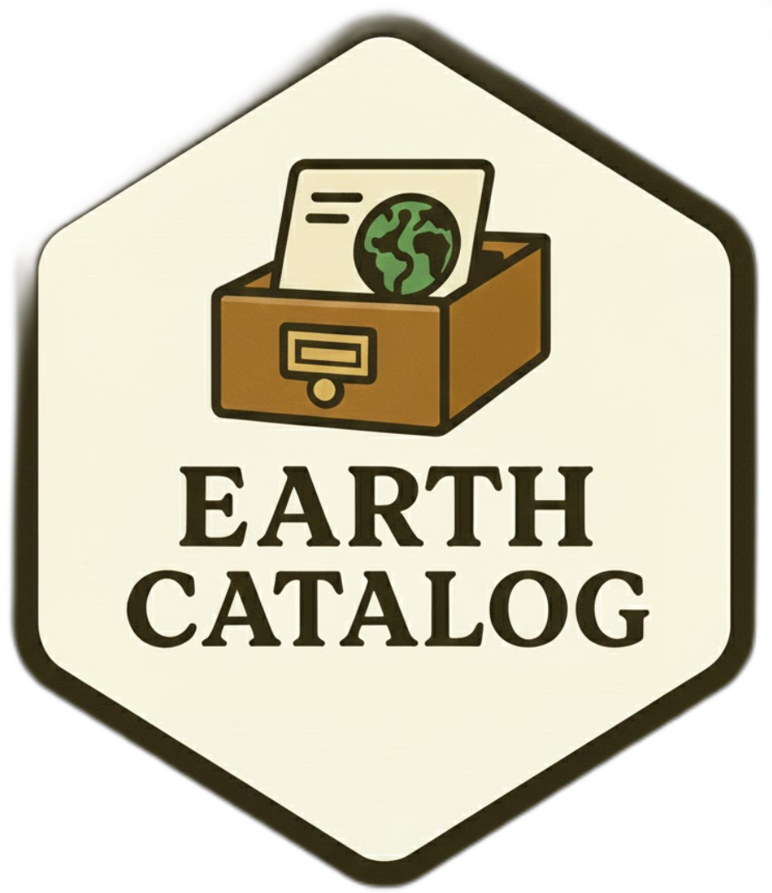

# earthcatalog

EarthCatalog is a Python library that transforms STAC (SpatioTemporal Asset Catalog) items into a
cloud-native, spatially partitioned GeoParquet catalog, enabling fast bulk spatial queries and
scalable analysis of large Earth observation datasets.

---

## When to use EarthCatalog

**Ideal for:**

- Large-scale Earth observation data (>1M STAC items)
- Asset distribution is sparse and global, e.g. Sentinel or Landsat scenes
- Frequent spatial queries on specific regions
- Time-series analysis of locations over time
- Multi-sensor data fusion from different providers
- Real-time data ingestion with incremental updates

**Not ideal for:**

- Small datasets (<10K items) — overhead outweighs benefits
- Simple one-time processing without query needs
- Regional datasets with similar geometries/footprints
- Non-spatial data without geographic components

---

## Quick start

```bash
mamba env create -f environment.yml
mamba activate itslive-ingest
pip install -e .
```

### 1. Initial bulk ingest

Use the backfill pipeline for a first-time full ingest from an S3 Inventory manifest.
This fans out across Dask workers — each worker fetches STAC items from S3, writes
GeoParquet files directly to the warehouse, and returns only lightweight metadata to
the head node. Expect ~1M items/hour on a modest Dask cluster.

```bash
python scripts/run_backfill.py \
    --inventory  s3://my-bucket/inventory/manifest.json \
    --catalog    /tmp/catalog.db \
    --warehouse  s3://my-bucket/warehouse \
    --scheduler  local \
    --workers    32
```

### 2. Daily delta ingest

After the initial ingest, use the daily delta pipeline to detect and ingest new items.
The delta producer reads the S3 Inventory manifest, hashes item IDs with xxh3_128,
anti-joins against the warehouse hash index (~2 seconds for 40M items), and writes
a delta parquet with only new items.

```bash
# Produce delta (runs daily via GitHub Actions)
python scripts/daily_delta.py \
    s3://log-bucket/inventory/.../manifest.json \
    --warehouse-hash s3://my-bucket/warehouse_id_hashes.parquet \
    --delta-prefix s3://my-bucket/delta

# Ingest delta (runs weekly via GitHub Actions)
python scripts/run_backfill.py \
    --inventory s3://my-bucket/delta/pending/delta_2026-04-27.parquet \
    --delta \
    --scheduler local \
    --workers 4
```

### 3. Spatial query

EarthCatalog stores grid metadata (type and resolution) as Iceberg table
properties at ingest time. Use `CatalogInfo` to discover the grid system and
prune files via Iceberg partition filtering before querying.

#### Option A — DuckDB (tabular)

```python
import duckdb
from shapely.geometry import Point
from earthcatalog.core import catalog, store_config
from obstore.store import S3Store

# Point to the public catalog (no credentials needed)
store = S3Store(bucket='its-live-data', region='us-west-2', skip_signature=True)
store_config.set_store(store)
store_config.set_catalog_key('test-space/stac/catalog/earthcatalog.db')
catalog.download_catalog('/tmp/catalog.db')

c     = catalog.open(db_path='/tmp/catalog.db',
                     warehouse_path='s3://its-live-data/test-space/stac/catalog/warehouse')
table = catalog.get_or_create(c)
info  = catalog.info(table)

# Prune to the relevant Parquet files (cell + year partitions)
point = Point(-133.99, 58.74)   # inside item footprints in this cell
paths = info.file_paths(table, point, start_datetime='2020-01-01',
                        end_datetime='2022-12-31')

con = duckdb.connect()
con.execute("INSTALL spatial; LOAD spatial;")

df = con.execute(f"""
    SELECT id, platform, datetime
    FROM read_parquet({paths})
    WHERE datetime >= '2020-01-01'
      AND datetime <= '2022-12-31T23:59:59Z'
      AND ST_Intersects(geometry, ST_GeomFromText('{point.wkt}'))
    ORDER BY datetime
    LIMIT 10
""").df()
```

#### Option B — rustac + CQL2 (STAC-native)

[rustac](https://github.com/gadomski/rustac) queries the same GeoParquet files
using the STAC API search model with CQL2 filters.

```python
import rustac, cql2, json, pystac
from earthcatalog.core import catalog, store_config
from obstore.store import S3Store
from shapely.geometry import Point

store = S3Store(bucket='its-live-data', region='us-west-2', skip_signature=True)
store_config.set_store(store)
store_config.set_catalog_key('test-space/stac/catalog/earthcatalog.db')
catalog.download_catalog('/tmp/catalog.db')

c     = catalog.open('/tmp/catalog.db',
                     's3://its-live-data/test-space/stac/catalog/warehouse')
table = catalog.get_or_create(c)
info  = catalog.info(table)

point = Point(-133.99, 58.74)
paths = info.file_paths(table, point, start_datetime='2020-01-01',
                        end_datetime='2022-12-31')

client = rustac.DuckdbClient()
cql2_filter = cql2.parse_text('percent_valid_pixels > 50').to_json()

# rustac.DuckdbClient.search() takes one href at a time
items = []
for path in paths:
    items.extend(client.search(path, filter=cql2_filter))

# Hydrate to pystac.Item (assets/links stored as JSON strings in GeoParquet)
def to_stac(raw: dict) -> pystac.Item:
    for key in ('assets', 'links', 'bbox'):
        if isinstance(raw.get(key), str):
            raw[key] = json.loads(raw[key])
    return pystac.Item.from_dict(raw)

stac_items = [to_stac(i) for i in items]
```

## Documentation

See the [hosted documentation](https://nasa-itslive.github.io/earthcatalog/) for the full user guide,
architecture overview, and API reference.

---

## Requirements

- Python 3.12+
- See `environment.yml` for the full dependency list

Primary dependencies: `pyarrow`, `pyiceberg`, `obstore`, `rustac`, `h3-py`, `shapely`, `duckdb`
