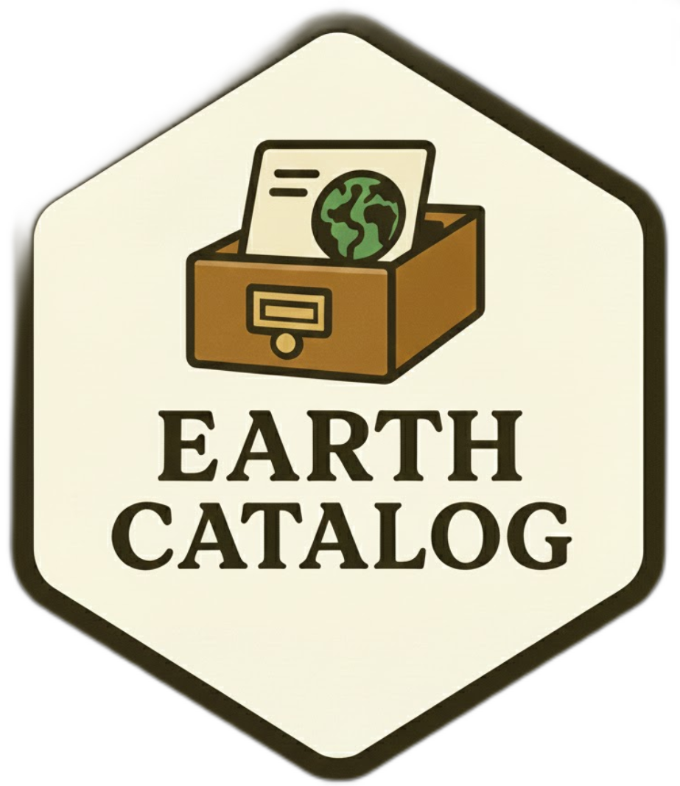

# earthcatalog

Spatially-partitioned STAC ingest pipeline backed by Apache Iceberg. Transforms STAC items from S3 into a queryable GeoParquet catalog with spatial + temporal partition pruning.

```python
import earthcatalog as ec
from obstore.store import S3Store

store = S3Store(bucket="its-live-data", region="us-west-2")
catalog = ec.open(store=store, base="s3://bucket/catalog")

# Ingest (delta appends to the unified index; resumable by default)
catalog.ingest_inventory("delta.parquet", mode="delta")

# Full ingest (Dask/Coiled)
from earthcatalog.ingest_config import IngestConfig
catalog.ingest_inventory("full_inventory.parquet", config=IngestConfig(create_client=coiled.Client))

# Search — returns pystac Items with Iceberg pruning + CQL2 filters
results = catalog.search(
    intersects={"type": "Point", "coordinates": [0, 60]},
    datetime="2020-01-01/2020-12-31",
    max_items=100,
)
for item in results.items():
    print(item.id, item.properties["platform"])
```

## Install

```bash
pip install earthcatalog
```

## Why

Traditional STAC databases (PostgreSQL + PostGIS) are fine for lookups but struggle with bulk exports. earthcatalog skips the database — spatially partitioned GeoParquet files sit on S3, indexed by an Iceberg table through a single SQLite file. DuckDB reads them directly with zero serialization overhead.

- No moving parts: Parquet files on S3, no database to maintain
- Spatial pruning: Iceberg partition filtering via H3 cells — queries open only relevant files
- Zero infra: SQLite catalog lives on S3, no Glue, no REST server
- Public data accessible without AWS credentials (`skip_signature=True`)

## Documentation

See the [hosted docs](https://nasa-itslive.github.io/earthcatalog/) for the full guide.
